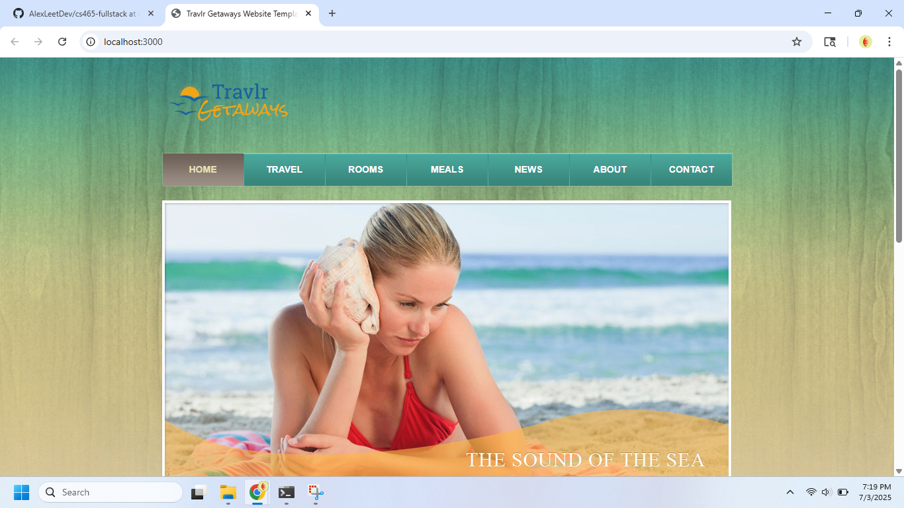

# 📦 CS-465 Module 1 - Static Website with Express

[](https://nodejs.org/)
[](https://expressjs.com/)
[](LICENSE)
[](https://github.com/AlexLeetDev/cs465-fullstack/tree/module1)

This branch (`module1`) contains the initial static website shell for Travlr Getaways, created using Node.js and the Express framework. It is part of the Module One assignment for CS-465 Full Stack Development I.

---

## 🛠 Technologies Used

- **Node.js** – JavaScript runtime
- **Express** – Web server framework for node
- **HTML/CSS** – Static site content

---

## 📁 Project Structure

```plain text

travlr/
├── node_modules/
├── public/
│   ├── about.html
│   ├── contact.html
│   ├── index.html
│   ├── meals.html
│   ├── news.html
│   ├── rooms.html
│   ├── travel.html
│   ├── css/
│   ├── images/
├── server.js
├── package.json
└── README.md

```

- All the website files are in the `public/` folder (HTML, CSS, images).
- The `server.js` file starts the server and makes the website available in your browser.

---

## 🚀 How to Run the Project

1. **Clone the repo**

   ```bash
   git clone https://github.com/AlexLeetDev/cs465-fullstack.git
   cd cs465-fullstack
   git checkout module1
   ```

2. **Install Dependencies**

   ```bash
   npm install
   ```

3. **Start the server**

   ```bash
   node server.js
   ```

4. **View in browser**

   Navigate to [http://localhost:3000](http://localhost:3000)

---

## ✅ What This Demonstrates

- A working static website
- Set up using Node.js and Express
- All files placed in the correct folders
- Runs correctly when tested in a browser

---

## 📸 Screenshot

Below is a screenshot of the site running locally:



---

## 📌 Notes

This branch is isolated for Module One and does not include full stack functionality yet. Future modules will expand on this structure.
